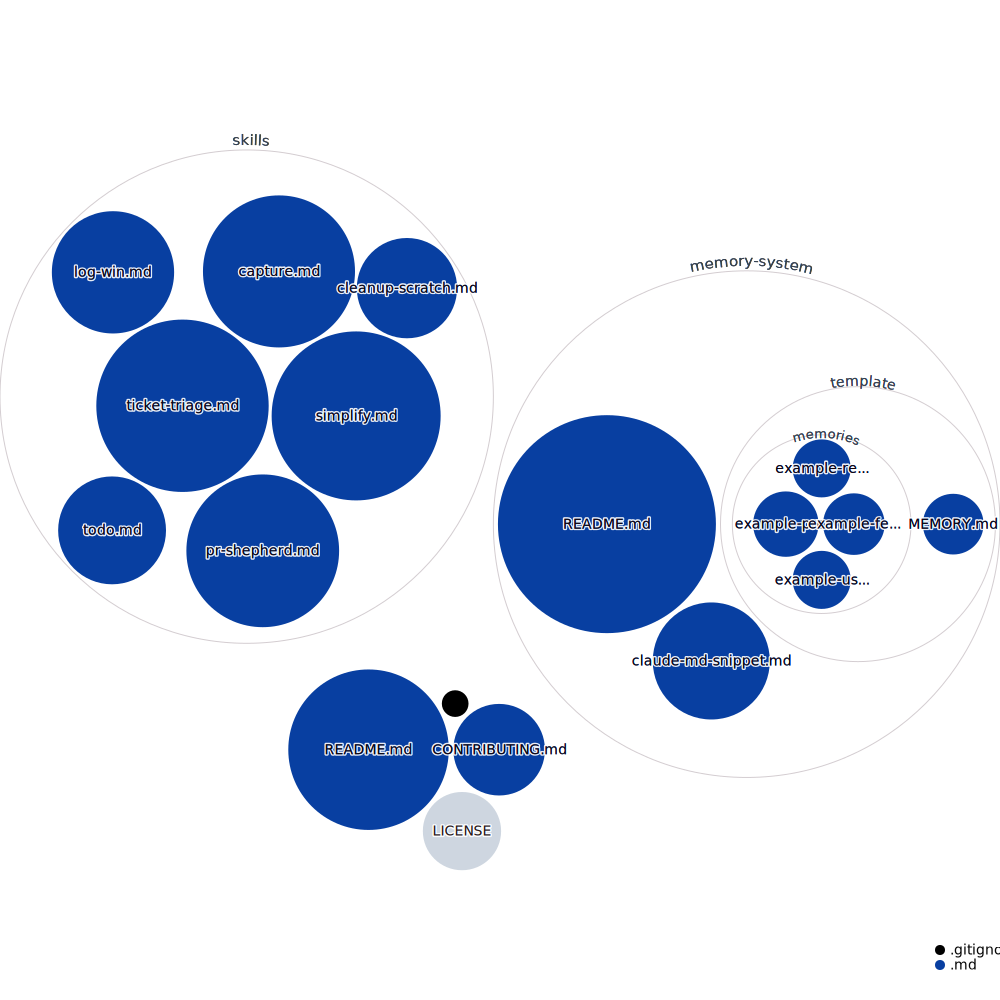

# Claude Code Skills



A collection of reusable [Claude Code](https://docs.anthropic.com/en/docs/claude-code) skills for developer productivity. These are patterns I use daily for capturing information, logging wins, managing todos, triaging Jira tickets, and more.

## Why skills are like magic ✨

Before skills, you needed to understand APIs and how computers work to automate anything. Skills flip that: you describe what you want in plain language, and the AI picks it up. The interface moved from technical knowledge to clear intent.

## What are Claude Code skills?

Skills are markdown files that teach Claude Code how to perform specific tasks. When you type `/skill-name` in Claude Code, it loads the skill's instructions and follows them. Think of them as reusable prompt templates with structure.

Skills live in `~/.claude/skills/` (global) or `.claude/skills/` (per-project). Each skill is either:
- A single file: `skills/my-skill.md`
- A directory: `skills/my-skill/SKILL.md` (for skills with supporting files)

## Skills in this repo

| Skill | Description | Complexity |
|-------|-------------|------------|
| [capture](skills/capture.md) | Extract action items, decisions, and deadlines from pasted text and route them to structured files | Medium |
| [log-win](skills/log-win.md) | Quick-capture wins and achievements to a structured JSONL log with auto-categorization | Simple |
| [cleanup-scratch](skills/cleanup-scratch.md) | Scan a scratch directory for stale files, categorize, report, and delete with confirmation | Simple |
| [todo](skills/todo.md) | Manage todos in a structured directory with done-folder workflow -- list, add, check off, and archive | Simple |
| [ticket-triage](skills/ticket-triage.md) | Pull assigned Jira tickets, categorize by priority, detect stuck work, and recommend next action | Medium |
| [simplify](skills/simplify.md) | Review changed code for reuse, quality, and efficiency -- structured refactoring without changing behavior | Simple |

## Installation

Copy any skill file into your Claude Code skills directory:

```bash
# Global (available in all projects)
cp skills/capture.md ~/.claude/skills/

# Per-project
cp skills/capture.md .claude/skills/
```

Then invoke with `/capture`, `/log-win`, `/cleanup-scratch`, `/todo`, `/ticket-triage`, or `/simplify` in Claude Code.

## Anatomy of a skill

Every skill starts with YAML frontmatter:

```yaml
---
name: my-skill
description: One-line description of what this skill does
user_invocable: true
---
```

- `name` -- kebab-case identifier, used as the slash command name
- `description` -- shown in skill listings and used by Claude to decide when to suggest the skill
- `user_invocable: true` -- makes it callable via `/name`

The body is markdown that instructs Claude Code what to do. Structure it as:
1. **Context** -- what the skill is and when to use it
2. **Configuration** -- paths, constants (use placeholders users can customize)
3. **Steps** -- numbered workflow Claude should follow
4. **Output format** -- what the result should look like
5. **Rules** -- guardrails and edge cases

## Customization

These skills use placeholder paths like `~/scratch/` and `~/logs/`. Update them to match your setup before use. Each skill has a "Configuration" section at the top with all paths and constants in one place.

## Writing your own skills

Tips from building dozens of skills:

1. **Be specific about file formats.** If the skill writes JSON, show the exact schema. Claude follows examples better than descriptions.
2. **Use numbered steps.** Claude executes them in order and doesn't skip steps.
3. **Include the "don't" rules.** "Never overwrite existing files -- only append" prevents data loss.
4. **Keep configuration at the top.** Makes it easy to customize without reading the whole skill.
5. **Test the unhappy path.** What should Claude do when the input is ambiguous? When the file doesn't exist? Spell it out.

## License

MIT
